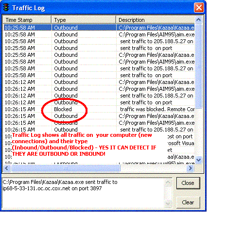



## CyberAlert Personal Firewall

### Description

CyberAlert Personal Firewall - First Public Release. Just like professional firewalls, detects all internet connections and maps them to their process. You can set rules for specific applications, trust, block, or ask every time. NOTE - THIS PROGRAM ONLY WORKS ON XP/2K/NT because they are the only ones who have the NETSTAT -o command used to map processes. The latter asks you every time it connects to a new remote host. It can detect inbound and outbound, and tell you what kind the connection is. While your computer is idle, BLOCK ALL will block all unknown traffic on your computer. In case of hackers utilizing dangerous ports such as FTP, UPnP, Net Bios, etc... IT will warn you of such connections with the option to allow or block. Cool eh? In case you need to review activity on your computer, SECURITY and TRAFFIC Logs will show you all you need to know. Download this program now only 99kb. Please *VOTES/FEEDBACK GREATLY APPRECIATED* You may recognize the code to be similar to my first submission CyberSentry personal firewall. API and MODULES were re-used, but all other code was completely redone. For an example CyberSentry did not map correctly, only detecting a few processes. Also CyberAlert only launches an alert window ONCE per connection unlike CyberSentry which bombards you with dozens of boxes. CyberAlert also shows the application title like "Kazaa Media Desktop". CyberAlert on my computer detected AIM.exe, KAZAA.exe, IEXPLORE.EXE, RUNDLL32.EXE, SCVHOST.EXE (Checks for win updates), QTIMEUPDATER.exe (QuickTime Updaer), and even SAVE.exe and GMT.exe (Adware included with some programs I had). For programs like adware/spyware that you need to keep installed for programs to work, CyberAlert has a rule called 'Auto-terminate' which kills the process every time it runs! Again please check this program out 99kb only, votes and comments appreciated!
 
### More Info
 

             |
---                |---
**Submitted On**   |2003-07-13 10:29:54
**By**             |[Intrepid Software](https://github.com/Planet-Source-Code/PSCIndex/blob/master/ByAuthor/intrepid-software.md)
**Level**          |Advanced
**User Rating**    |4.8 (149 globes from 31 users)
**Compatibility**  |VB 5\.0, VB 6\.0
**Category**       |[Internet/ HTML](https://github.com/Planet-Source-Code/PSCIndex/blob/master/ByCategory/internet-html__1-34.md)
**World**          |[Visual Basic](https://github.com/Planet-Source-Code/PSCIndex/blob/master/ByWorld/visual-basic.md)
**Archive File**   |[CyberAlert1613897132003\.zip](https://github.com/Planet-Source-Code/intrepid-software-cyberalert-personal-firewall__1-46876/archive/master.zip)

